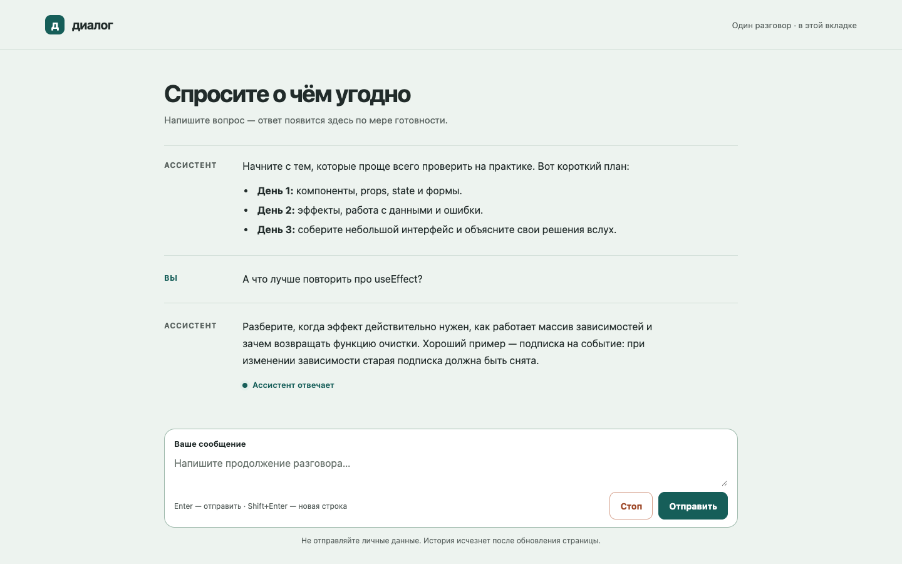
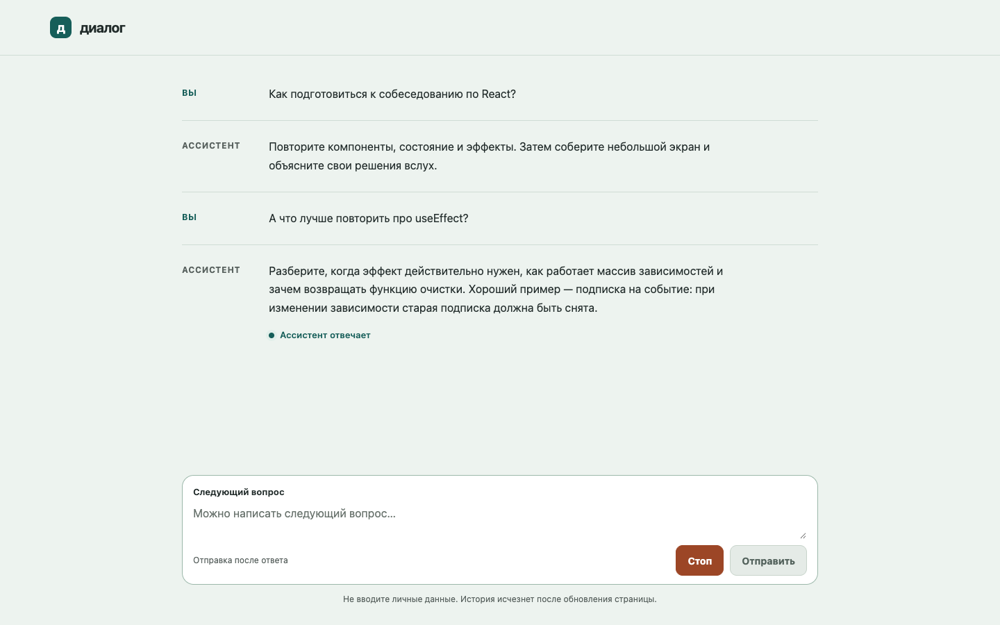
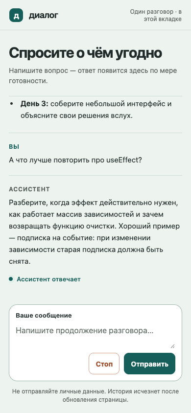
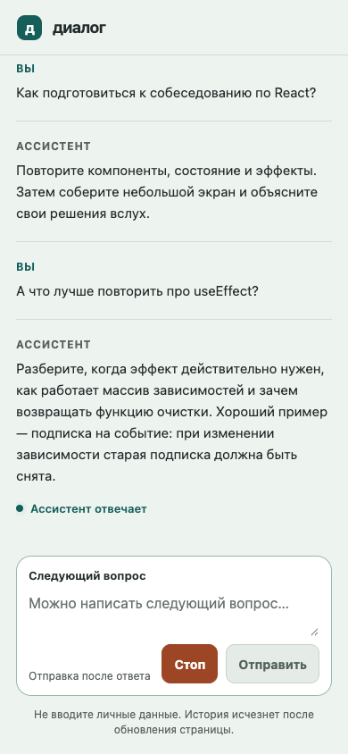

# U04 — визуальная проверка

**Состояние:** потоковый ответ, светлая тема. Источник и приложение показывают один и тот же диалог и один viewport.

## Снимки и размеры

| Viewport | Исходный макет | Реализация | Размер источника | Размер снимка | Нормализация |
| --- | --- | --- | --- | --- | --- |
| Desktop | `docs/ui/desktop.png` | `docs/ui/u04-desktop.png` | 1440×900 px | 1440×900 px | Не требовалась; снимок Playwright `scale: css` |
| Mobile | `docs/ui/mobile.png` | `docs/ui/u04-mobile.png` | 390×844 px | 390×844 px | Не требовалась; снимок Playwright `scale: css` |

## Сравнение полных экранов

| D01 — источник | U04 — реализация |
| --- | --- |
|  |  |
|  |  |

Обе пары также сведены в единый горизонтальный кадр и просмотрены вместе. Desktop-композиция совпадает. На mobile совпадают верхняя граница истории, ритм сообщений, положение статуса и форма. Первый мобильный снимок был сделан после изменения размера уже открытой desktop-страницы и показал ложный сдвиг списка на 22 px: эффект начальной прокрутки успел сработать до изменения viewport. Страница была перезагружена при 390×844 и переснята; CSS не менялся, повторное сравнение совпало с источником.

## Проверка обязательных поверхностей

- **Типографика:** системный sans-serif, иерархия ролей и размеров текста совпадают; переносы строк одинаковые в обоих viewport.
- **Отступы и раскладка:** desktop-сетка и мобильный столбец совпадают с макетом; форма остаётся на месте и видна целиком.
- **Цвета:** фон, линии, акцент, статус и неактивная кнопка отправки соответствуют источнику.
- **Изображения и марка:** фотографий и сторонних иллюстраций в макете нет; текстовая марка и знак в шапке визуально совпадают с D01.
- **Текст:** подписи, примеры сообщений и статус потокового ответа совпадают с макетом.
- **Состояние и доступность:** снимок показывает историю `ol/li`, статус `role="status"`, подписанное поле и доступные кнопки. После замечания в PR история оставлена в Tab-порядке (`tabIndex={0}`) с видимым фокусом; ручная проверка подтвердила прокрутку Page Up/Page Down и переход Tab от истории к форме. Disabled-состояние отправки и видимость формы на 390×320 проверены ранее.
- **Консоль:** 0 ошибок и 0 предупреждений; присутствуют только информационное сообщение React DevTools и запись подключения HMR.

Отдельные увеличенные кропы не нужны: надписи, статусы, марка и элементы управления читаемы в исходном масштабе обоих полных снимков.

## Результат

Сопоставление не выявило применимых P0, P1 или P2 визуальных расхождений. Подключение API, реальная генерация и клавиша Esc остаются в границах следующих этапов A05/C06.

final result: passed
